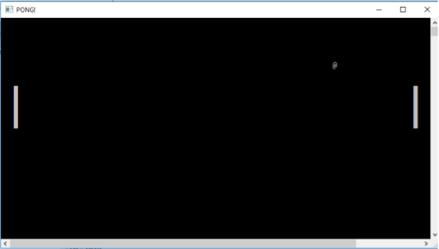

# pong-game

Pour un projet de programmation en langage en C, nous avons décider de codé un PONG jeu datant de 1972, imaginé par Nolan Bushnell.
Nous avions 19h pour le programmer, mon binôme et moi avons juste fait un mode joueur contre joueur. 

